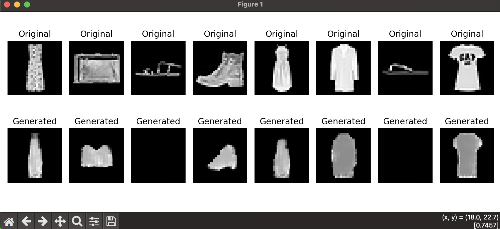

# GenAI Models

This repository contains implementations of deep learning models related to generative AI tasks.

## Autoencoder

The autoencoder in this repository encodes input images into a latent representation and then decodes them back to an output image. This process allows the model to learn efficient, compressed representations of the data.

**Key features:**
- Encoder: Uses `Conv2d` layers with downsampling to reduce the input image to a low-dimensional latent space.
- Decoder: Uses `ConvTranspose2d` layers to reconstruct the original image from the latent representation.
- Training: The model is trained using a simple reconstruction loss (such as MSE or BCE) to ensure the decoded output closely matches the input.

Below is a comparison of a batch of original images and their reconstructed counterparts after training the autoencoder:

**Original vs. Reconstructed Images**

| Original vs reconstructed|
|------------------------------------|
|  |

## MLP Model (Convolution-based)

Despite being called “MLP,” the model in the `MLP` folder actually uses `Conv2d` layers to process image data. Instead of being a pure multi-layer perceptron, it’s a CNN that:
- Extracts local features via convolutional layers.
- Potentially adds fully connected layers at the end for classification.

